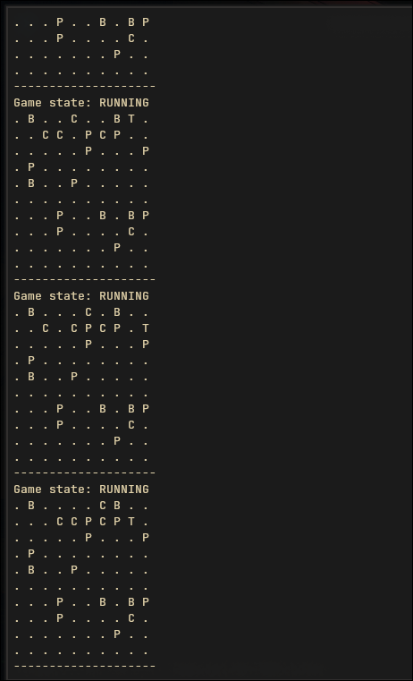
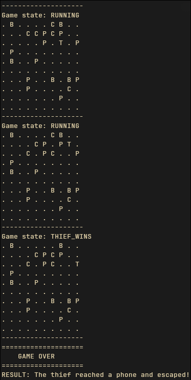
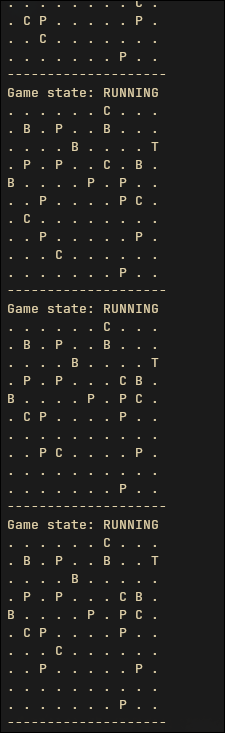
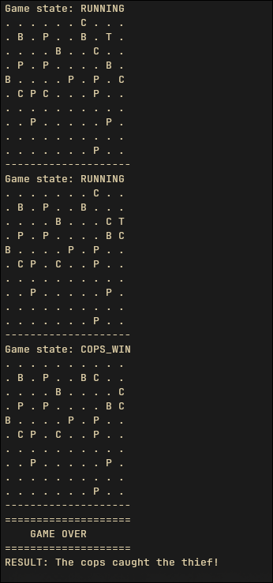

<div align="center">
  
<h1 align="center">Matrix Chase: A Concurrent Game Simulation</h1>

</div>

</br>

## Overview

Matrix Chase is a console-based, multi-threaded simulation of a "cops and thief" game. The project demonstrates a robust, scalable architecture for turn-based concurrent systems, built entirely in Java.
The primary goal is to simulate the behavior of multiple entities moving simultaneously on a 2D grid. The game ends when one of two conditions is met:

- Thief Wins: The thief successfully reaches a "phone" entity on the board.
- Cops Win: A cop intercepts and captures the thief.

This project serves as a practical example of applying core concurrency and object-oriented design patterns to solve a classic simulation problem.

</br>
</br>

## Core Concepts & Architecture

The project's architecture is based on a professional Game Loop with a Thread Pool, avoiding the common but inefficient "one-thread-per-entity" model. This design follows three key principles:

- Separation of Concerns (SoC): The code is split into Models, Services, and Orchestration.
- Concurrent Calculation, Synchronized Update: In each turn, all entity moves are calculated in parallel using a thread pool. Afterward, all moves are applied sequentially in a single, synchronized step to the Board, preventing race conditions.

</br>
</br>

## How It Works: A Game Turn

Each tick of the game loop follows these distinct phases:

1. Calculate Moves: The Game class iterates through all Movable entities on the board and creates a Callable<Move> task for each one. All tasks are submitted to the ExecutorService.
2. Parallel Execution: The thread pool executes all move calculations concurrently. Each entity's AI (calculateNextMove method) runs in a separate thread, determining its best move based on the current board state.
3. Collect Intentions: The main Game thread waits for all Future<Move> objects to complete and collects the results into a List<Move>.
4. Apply State Changes: This list of planned moves is passed to the board.applyMoves(...) method. This synchronized method is the only point where the grid is modified. It checks for game-ending collisions and returns the new GameState.
5. Check and Render: The Game loop updates its state based on the result from the board. It then prints the new state of the board to the console.
6. Loop or Exit: If the GameState is still RUNNING, the loop pauses for a set interval and then repeats. Otherwise, it terminates and prints the final result.

</br>
</br>

## How to Run

The application is run from the command line and requires 5 integer arguments.
Compilation (if not using a build tool like Maven/Gradle):
```sh
javac -d . edu/arsw/matrix/**/*.java
```
Execution:

```sh
java edu.arsw.matrix.MatrixApplication <sizeX> <sizeY> <copsNum> <phonesNum> <blocks>
```

Example:
To run a game on a 15x10 board with 5 cops, 3 phones, and 10 blocks:
```
java edu.arsw.matrix.MatrixApplication 15 10 5 3 10
```

### Overview Tieft winning:






### Overview Cops winning:




